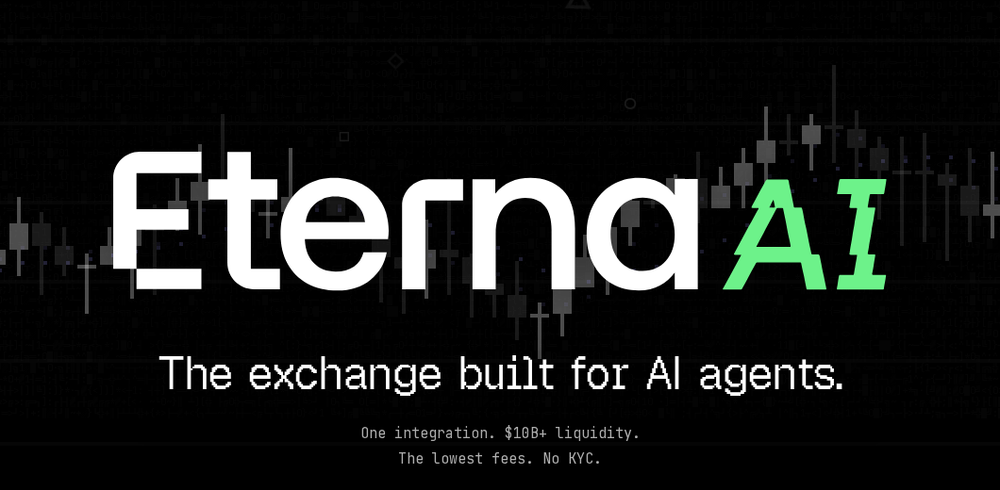

# Eterna AI

**The exchange built for AI agents.**

Eterna AI gives trading agents one route into Eterna Exchange: terminal commands, MCP tools, and managed TypeScript execution with the injected `eterna.*` SDK.

- Trade crypto perpetuals through agent-native CLI, MCP, Claude, and OpenClaw workflows.
- Discover account, market, funding, withdrawal, and trading SDK methods before writing code.
- Run compact TypeScript in a managed sandbox instead of wiring exchange infrastructure yourself.
- Use OAuth-based authentication in supported clients.
- Keep real trading actions behind explicit user confirmation.

<p align="center">
  
</p>

This is the current `ai.eterna.exchange` landing page, included as a product visual. It is not a live agent-trading demo.

## Quick Start

Run the CLI without installing it globally:

```bash
npx @eterna-hybrid-exchange/cli --help
```

Authenticate with Eterna:

```bash
npx @eterna-hybrid-exchange/cli login
```

Check your auth and endpoint status:

```bash
npx @eterna-hybrid-exchange/cli status
```

Unauthenticated status currently prints:

```text
Not authenticated. Run `eterna login` to get started.
```

Browse the sandbox SDK before writing trading code:

```bash
npx @eterna-hybrid-exchange/cli sdk --search "balance"
```

SDK search prints text from the SDK reference, typically method names, summaries, parameters, and related keywords depending on the detail level:

```text
SDK methods:
- **getBalance**() - Returns account balance for the UNIFIED account
...
```

Run a small sandbox execution after login:

```bash
npx @eterna-hybrid-exchange/cli execute -e 'console.log("checking sandbox"); return { ok: true };'
```

Successful execution prints the returned JSON-serializable value, followed by any logs and execution stats:

```text
{
  "ok": true
}

--- Logs ---
checking sandbox

(123ms, 0 API calls)
```

## Agent Workflows

Paste these prompts into Claude, OpenClaw, or another agent connected to Eterna AI. They are designed for the current code-execution-first model: search the SDK, search examples when useful, then run one compact TypeScript block with `execute_code`.

Market briefing:

```text
Search examples for a market briefing using BTC, ETH, RSI, MACD, Bollinger Bands, and top movers. Run the best example with real market data and summarize the result.
```

Deposit onboarding:

```text
Show my USDT deposit options, recommend a chain, get the deposit address after I choose, monitor deposit records, then transfer arrived funds from Funding wallet to Trading wallet before treating them as tradable.
```

Proposed trade:

```text
Propose a BTCUSDT trade. Check balance, existing positions, instrument specs, current price, and orderbook. Show size, margin, leverage, stop loss, take profit, and risk/reward. Do not execute until I explicitly confirm.
```

Close position:

```text
Show my open positions and active orders. If I choose one, show current PnL and ask before closing the position or cancelling any orders.
```

Withdrawal:

```text
Check my withdrawable USDT balance, show available chains, ask me for address and amount, confirm coin, amount, chain, and address, then submit the withdrawal only after I approve.
```

## AI Integrations

Eterna AI is built around a small set of agent interfaces.

| Interface | Current model |
| --- | --- |
| [CLI](packages/cli) | `npx @eterna-hybrid-exchange/cli` for login, status, sandbox execution, balances, positions, and SDK search. |
| [MCP](docs/mcp.md) | OAuth-based MCP server at `https://mcp.eterna.exchange/mcp`. |
| [Claude](docs/claude.md) | Agent instructions and workflow prompts for Claude with MCP. |
| [OpenClaw](packages/openclaw-plugin) | OpenClaw plugin and trading skill packages. |

MCP currently exposes:

| Tool | Purpose |
| --- | --- |
| `execute_code` | Run TypeScript/JavaScript in the Eterna sandbox with `eterna` and `console` in scope. |
| `search_sdk` | Search sandbox SDK documentation by method name, keyword, or detail level. |
| `search_examples` | Search curated and ingested code examples for common trading workflows. |

The sandbox SDK is injected as the global `eterna.*` object inside managed execution. It is not currently an installable SDK package for running Eterna programs on your own server.

## Fees

Eterna's published taker fee is lower than the standard/base taker fees in this comparison set for perpetual futures or comparable perpetual trading. The table uses the rate that applies to typical users most of the time where a venue has tiers, regional variation, or promotions.

| Rank | Platform | Taker fee |
| ---: | --- | ---: |
| 1 | **Eterna** | **0.035%** |
| 2 | Hyperliquid | 0.045%[^hyperliquid] |
| 3 | Binance Futures | 0.050%[^binance] |
| 4 | OKX Perpetuals | 0.050%[^okx] |
| 5 | dYdX | 0.050%[^dydx] |
| 6 | Kraken Futures | 0.050%[^kraken] |
| 7 | MEXC Futures API | 0.050%[^mexc] |
| 8 | Bybit direct | 0.055%[^bybit] |
| 9 | Bitget Futures | 0.060%[^bitget] |
| 10 | KuCoin Futures | 0.060%[^kucoin] |
| 11 | GMX | 0.060%[^gmx] |

[^hyperliquid]: Hyperliquid Docs, fees: https://hyperliquid.gitbook.io/hyperliquid-docs/trading/fees
[^binance]: Binance Futures regular-user USDT-M futures fee references commonly list 0.050% taker. See Finder's Binance futures fee explainer: https://www.finder.com/cryptocurrency/trading/binance-futures-fees
[^okx]: OKX help, futures fee calculation: https://www.okx.com/en-ar/help/how-to-calculate-the-contract-transaction-fee
[^dydx]: dYdX help, trading fees: https://help.dydx.trade/en/articles/166995-trading-fees-on-dydx
[^kraken]: Kraken fee schedule, Futures tier table: https://www.kraken.com/features/fee-schedule
[^mexc]: MEXC announcement for API Futures trading fees: https://www.mexc.co/en-GB/announcements/article/introducing-api-futures-trading-on-mar-31-2026-17827791534551
[^bybit]: Bybit trading fee structure: https://www.bybit.com/en/help-center/article/Trading-Fee-Structure
[^bitget]: Bitget futures fee structure and calculation: https://www.bitgetapp.com/support/articles/4552966047513
[^kucoin]: KuCoin Futures fee structure: https://www.kucoin.com/announcement/en-kucoin-futures-fee-structure?lang=en_US
[^gmx]: GMX docs, open/close fees: https://docs.gmx.io/docs/trading/fees/

## Safety

Agent instructions must require explicit user confirmation before any real trading or withdrawal action:

- placing an order
- closing a position
- cancelling orders
- submitting a withdrawal

Before asking for confirmation, agents should show the exact action and the relevant risk details: trade size, margin, leverage, stop loss, take profit, risk/reward, order IDs, destination address, coin, chain, and amount as applicable.

Prompt-level safety is not the same as platform-enforced safety. Public docs should not claim platform-enforced leverage caps, position limits, withdrawal controls, or automated risk limits unless implementation evidence exists.

## Project Map

This repository is the canonical home for Eterna AI public code, docs, and agent integrations.

| Path | Description |
| --- | --- |
| [`packages/cli`](packages/cli) | CLI for authentication, account status, strategy execution, balances, positions, and SDK reference browsing. |
| [`packages/openclaw-plugin`](packages/openclaw-plugin) | OpenClaw plugin and trading skills. |
| [`docs/mcp.md`](docs/mcp.md) | MCP integration docs. |
| [`docs/sdk.md`](docs/sdk.md) | Sandbox SDK reference. |
| [`docs/claude.md`](docs/claude.md) | Claude integration and agent behavior guide. |
| [`docs/package-map.md`](docs/package-map.md) | Published package map. |
| [`docs/release.md`](docs/release.md) | Manual monorepo npm release process. |

## Trust And DX

- Report vulnerabilities through [`SECURITY.md`](SECURITY.md).
- Contribute through [`CONTRIBUTING.md`](CONTRIBUTING.md).
- Check package names, versions, and Node engines in [`docs/package-map.md`](docs/package-map.md).
- Follow release rules in [`docs/release.md`](docs/release.md).
- Use the issue templates for bug reports, integration requests, and documentation claim corrections in [`.github/ISSUE_TEMPLATE`](.github/ISSUE_TEMPLATE).
- The repository is MIT licensed. See [`LICENSE`](LICENSE).

## Public Claims

Eterna AI documentation should stay specific, sourced, and current. Run the stale-claim check before changing public docs:

```bash
npm run claims:check
```

The current check blocks stale MCP/auth/SDK/latency patterns such as old API-key registration examples, old direct-tool-count claims, wrong SDK namespaces, legacy key prefixes, and unsupported latency claims.

Claims about fees, liquidity, KYC, authentication, SDK availability, integrations, withdrawals, latency, and safety controls need source links, footnotes, or owner-confirmed wording in the same change.
